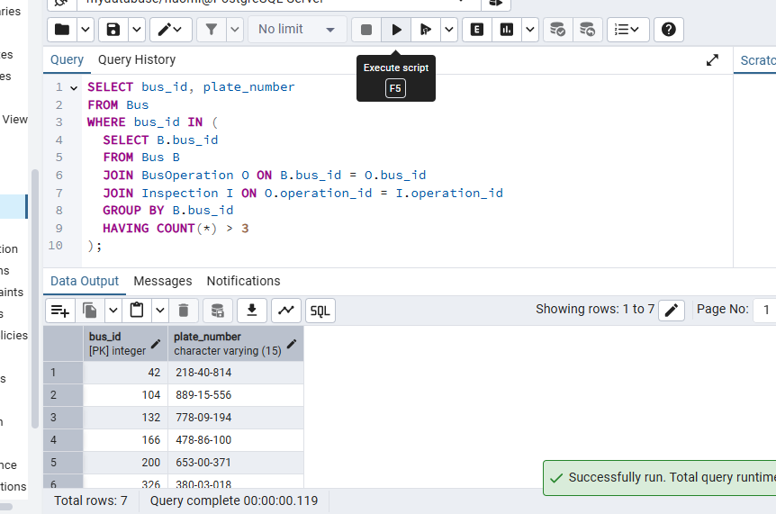
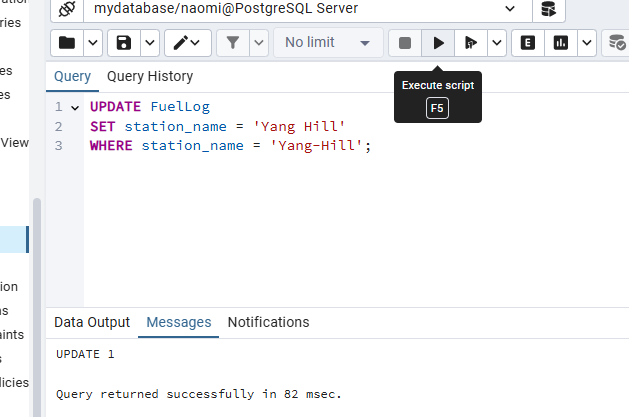
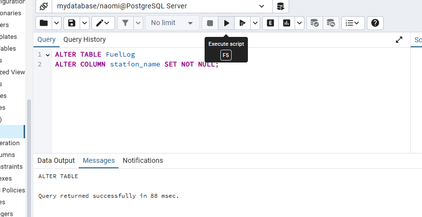

# Bus Company Management System

Naomi Reitzer and Sara Koskas

## Table of Contents  
- [Phase 1: Design and Build the Database](#phase-1-design-and-build-the-database)  
  - [Introduction](#introduction)  
  - [ERD (Entity-Relationship Diagram)](#erd-entity-relationship-diagram)  
  - [DSD (Data Structure Diagram)](#dsd-data-structure-diagram)  
  - [SQL Scripts](#sql-scripts)  
  - [Data](#data)
  - [Backup](#backup)

- [Phase 2: Queries and constraints](#phase-2-queries-and-constraints)
  - [SELECT Queries (8)](#select-queries-8)  
  - [DELETE Queries (3)](#delete-queries-3)  
  - [UPDATE Queries (3)](#update-queries-3)  
  - [Constraints](#constraints-added-alter-table)  
  - [Backup](#backup)  

- [Phase 3: Integration and Views](#phase-3-integration-and-views)  
  - [Drivers DSD](#drivers-dsd)  
  - [Drivers ERD](#drivers-erd)  
  - [Integrated ERD](#integrated-erd)  
  - [Integrated DSD](#integrated-dsd)  
  - [Intergation Commands](#integration-commands)
  - [Views and Queries Commands](#views-and-queries-commands)
  - [Backup](#backup)

- [Phase 4: Programming](#phase-4-programming)
  - [Table Changes](#table-changes)  
  - [First Program](#first-program)  
  - [Second Program](#second-program)  
  - [Backup](#backup)

- [Phase 5: Application](#phase-5-application)
  - [Installation Instructions](#installation-instructions)
  - [Development Tools and Technologies](#development-tools-and-technologies)
  - [Application Screenshots](#application-screenshots)
  - [How to Run the Application](#how-to-run-the-application)

## Phase 1: Design and Build the Database  

### Introduction

The **Bus Company Management System** is designed to efficiently oversee the operations of a public transportation organization. This system ensures seamless coordination between different divisions, including fleet management, employee assignments, route scheduling, ticketing, finance, and customer support.

#### Purpose of the Database
This database serves as a structured and reliable solution for bus company operations by:
- **Managing the fleet through** detailed tracking of buses, maintenance records, fuel consumption and inspections.
- **Organizing driver and staff assignments,** ensuring proper scheduling and payroll management.
- **Optimizing route planning and scheduling** to improve operational efficiency and passenger service.  
- **Handling ticketing and booking,** allowing passengers to reserve seats and track ticket purchases.
- **Maintaining financial records,** including revenue, expenses, and tax reporting.
- **Providing customer support,** allowing for complaint tracking, lost-and-found management and feedback collection.

#### Potential Use Cases
- **Fleet Managers** can track bus maintenance, fuel logs and inspections to ensure operational efficiency. 
- **Drivers and Staff** can view their schedules, salary details and attendance records.
- **Passengers** can book tickets, view schedules, and submit feedback or complaints.
- **Customer Support Representatives** can manage inquiries, complaints and lost-and-found items.

This structured database enhances operational efficiency, financial tracking and customer satisfaction, making it an essential tool for managing large-scale bus transportation services.

###  ERD (Entity-Relationship Diagram)    
  

###  DSD (Data Structure Diagram)   
  

###  SQL Scripts  
Provide the following SQL scripts:  
- **Create Tables Script** - The SQL script for creating the database tables is available in the repository:  

 📜 **[View `create_tables.sql`](Phase1/Scripts/FleetManagementCreateTable.sql)**  

- **Insert Data Script** - The SQL script for insert data to the database tables is available in the repository:  

 📜 **[View `insert_tables.sql`](Phase1/Scripts/FleetManagementInsertTables.sql)**  
 
- **Drop Tables Script** - The SQL script for droping all tables is available in the repository:  

 📜 **[View `drop_tables.sql`](Phase1/Scripts/FleetManagementDropTable.sql)**  

- **Select All Data Script**  - The SQL script for selectAll tables is available in the repository:  

 📜 **[View `selectAll_tables.sql`](Phase1/Scripts/FleetManagementSelectAll.sql)**  
  
###  Data  
####  First tool: using [mockaro](https://www.mockaroo.com/) to create csv file
#####  Entering a data to Bus table
-  bus id scope 1-400
📜[View `Bus.csv`](Phase1/MockedData/Bus.csv)


results for  the command `SELECT COUNT(*) FROM Bus;`:


####  Second tool: using [generatedata](https://generatedata.com/generator). to create csv file 
#####  Entering a data to Insurance table
- insurance id scope 1-400
📜[View `Insurance.csv`](Phase1/MockedData/Insurance.csv)


results for  the command `SELECT COUNT(*) FROM Insurance;`:


####  Third tool: using python to create csv file
#####  Entering a data to BusOperation, FuelLog, Inspection and Maintenance tables
📜[View `generate_data.py`](Phase1/MockDataScript/generate_data.py)
[Enter CSV files folder](Phase1/MockedData)


### Backup 
-   backups files are kept with the date and hour of the backup:  
[Enter Backup folder](Phase1/Backup)


## Phase 2: Queries and constraints

📜[View `Queries.sql`](Phase2/scripts/Queries.sql)

### SELECT Queries (8)

1. עלות כוללת של פעולות לכל אוטובוס בשנת 2025

<pre>
SELECT B.bus_id, EXTRACT(YEAR FROM O.operation_date) AS year, SUM(O.operation_cost) AS total_cost
FROM BusOperation O
JOIN Bus B ON B.bus_id = O.bus_id
WHERE EXTRACT(YEAR FROM O.operation_date) = 2025
GROUP BY B.bus_id, year
ORDER BY total_cost DESC;
</pre>


2. ביטוחים שפג תוקפם החודש
<pre>
SELECT insurance_id, bus_id, insurance_start_date, end_date
FROM Insurance
WHERE EXTRACT(MONTH FROM end_date) = EXTRACT(MONTH FROM CURRENT_DATE)
  AND EXTRACT(YEAR FROM end_date) = EXTRACT(YEAR FROM CURRENT_DATE);
</pre>


3. ממוצע עלות פעולות לאוטובוסים לא פעילים
<pre>
SELECT B.bus_id, AVG(O.operation_cost) AS avg_cost
FROM Bus B
JOIN BusOperation O ON B.bus_id = O.bus_id
WHERE B.bus_status = 'Inactive'
GROUP BY B.bus_id;
</pre>


4. חמש פעולות התדלוק עם כמות הדלק הגבוהה ביותר
<pre>
SELECT B.bus_id, F.station_name, F.fuel_added_liters, O.operation_date
FROM FuelLog F
JOIN BusOperation O ON O.operation_id = F.operation_id
JOIN Bus B ON B.bus_id = O.bus_id
ORDER BY F.fuel_added_liters DESC
LIMIT 5;
</pre>


5. אוטובוסים עם יותר מ-3 ביקורות
<pre>
SELECT bus_id, plate_number
FROM Bus
WHERE bus_id IN (
  SELECT B.bus_id
  FROM Bus B
  JOIN BusOperation O ON B.bus_id = O.bus_id
  JOIN Inspection I ON O.operation_id = I.operation_id
  GROUP BY B.bus_id
  HAVING COUNT(*) > 3
);
</pre>



6. סך הביקורות לכל אוטובוס לפי שנה ותוצאה
<pre>
SELECT B.bus_id, EXTRACT(YEAR FROM O.operation_date) AS year, I.inspection_result, COUNT(*) AS total_inspections
FROM Inspection I
JOIN BusOperation O ON O.operation_id = I.operation_id
JOIN Bus B ON B.bus_id = O.bus_id
GROUP BY B.bus_id, year, I.inspection_result
ORDER BY year, B.bus_id;
</pre>


7. תחזוקות שבוצעו בין ינואר למאי 
<pre>
SELECT B.bus_id, O.operation_date, M.maintenance_type
FROM BusOperation O
JOIN Bus B ON B.bus_id = O.bus_id
JOIN Maintenance M ON M.operation_id = O.operation_id
WHERE EXTRACT(MONTH FROM O.operation_date) BETWEEN 1 AND 5;
</pre>


8. מספר תחזוקות עתידיות לכל סוג טיפול
<pre>
SELECT maintenance_type, COUNT(*) AS upcoming_maintenances
FROM Maintenance
WHERE next_due_date > CURRENT_DATE
GROUP BY maintenance_type;
</pre>


### DELETE Queries (3)

1. מחק ביטוחים שפג תוקפם
<pre>
DELETE FROM Insurance
WHERE end_date < CURRENT_DATE;
</pre>


2. מחק פעולות ללא עלות
<pre>
DELETE FROM BusOperation
WHERE operation_cost = 0;
</pre>


3. מחק אוטובוסים ללא פעולות
<pre>
DELETE FROM Insurance
WHERE bus_id NOT IN (
  SELECT DISTINCT bus_id FROM BusOperation
);
DELETE FROM Bus
WHERE bus_id NOT IN (
  SELECT DISTINCT bus_id FROM BusOperation
);
</pre>


### UPDATE Queries (3)

1. סמן ביטוחים שפג תוקפם בסטטוס 'לא פעיל' בטבלת האוטובוסים
<pre>
UPDATE Bus
SET bus_status = 'Inactive'
WHERE bus_id IN (
  SELECT bus_id FROM Insurance
  WHERE end_date < CURRENT_DATE
);
</pre>


2. הגדל את עלות הפעולה ב-10% עבור פעולות עתירות דלק (מעל 50 ליטר)
<pre>
UPDATE BusOperation
SET operation_cost = operation_cost * 1.10
WHERE operation_id IN (
  SELECT operation_id FROM FuelLog
  WHERE fuel_added_liters > 50
);
</pre>


3. עדכון שם תחנת דלק
<pre>
UPDATE FuelLog
SET station_name = 'Yang Hill'
WHERE station_name = 'Yang-Hill';
</pre>




### Constraints

📜[View `Constraints.sql`](Phase2/scripts/Constraints.sql)

1. ברירת מחדל לסטטוס אוטובוס
<pre>
ALTER TABLE Bus
ALTER COLUMN bus_status SET DEFAULT 'Active';
</pre>


2. לבדוק שעלות פעולה גדולה מאפס
<pre>
ALTER TABLE BusOperation
ADD CONSTRAINT check_operation_cost_positive CHECK (operation_cost > 0);
</pre>


3. לא לאפשר שדה תחנת דלק ריק
<pre>
ALTER TABLE FuelLog
ALTER COLUMN station_name SET NOT NULL;
</pre>




### Backup
-   backups files are kept with the date and hour of the backup:  
[Enter Backup folder](Phase2/Backup)


## Phase 3: Integration and Views

### Drivers DSD


### Drivers ERD


### Integrated ERD


### Integrated DSD


### Intergation Commands
 📜 **[View `Integrate.sql`](Phase3/Integrate.sql)**


### Views and Queries Commands
 📜 **[View `Views.sql`](Phase3/Views.sql)**


### Backup
[Enter Backup folder](Phase3/Backup)


## Phase 4: Programming

### Table Changes
 📜 **[View 'AlterTable.sql'](Phase4/AlterTable.sql)**

### First Program
#### Bus Operations Program

 📜 **[View code](Phase4/1-BusOperationsSystem.sql)**

התוכנית מציגה לוח תחזוקה, מעבדת 3 פעילויות לדוגמה ומציגה סיכום פעילות חודשית של האוטובוסים.


 📜 **[View Program output](Phase4/Program1Output.txt)**

### Second Program
#### Driver Management Program

 📜 **[View code](Phase4/2-DriverManagementSystem.sql)**

התוכנית מבצעת זרימת עבודה מלאה: קוראת ללוח הזמנים הנוכחי, מקצה משמרות חדשות לשבוע הבא, ומציגה דוח סיכום עם המלצות ניהוליות על בסיס הנתונים.


 📜 **[View Program output](Phase4/Program2Output.txt)**

### Backup
[Enter Backup folder](Phase4/Backup)


## Phase 5: Application

### Installation Instructions

#### דרישות מערכת
- Python 3.7 או גרסה חדשה יותר
- PostgreSQL מותקן ופועל

#### שלבי התקנה

1. **שכפול/הורדת הפרויקט**
   ```bash
   cd Phase5
   ```

2. **התקנת חבילות Python הנדרשות**
   ```bash
   pip install -r requirements.txt
   ```

3. **הגדרת מסד הנתונים**
   - ודא שמסד הנתונים PostgreSQL פועל
   - עדכן את פרטי החיבור בקובץ `database_connection.py`:
     ```python
     def connect(self, host="localhost", port="5432", database="mydatabase", user="naomi", password="naomi01"):
     ```

4. **הרצת האפליקציה**
   ```bash
   python main.py
   ```

### Development Tools and Technologies

#### כלי הפיתוח והטכנולוגיות שבהם השתמשנו:

**1. שפת התכנות - Python**
- בחרנו ב-Python בשל פשטותה וספרייה עשירה של כלים לפיתוח ממשקי משתמש
- תומכת חיבור מצוין למסדי נתונים PostgreSQL

**2. ספרייה לממשק המשתמש - Tkinter**
- ספרייה מובנית של Python לפיתוח ממשקי משתמש גרפיים
- מאפשרת יצירת חלונות, כפתורים, טבלאות וטפסים בקלות
- תומכת בעיצוב מותאם אישית וצבעים

**3. חיבור למסד הנתונים - psycopg2**
- מתאם מתקדם לחיבור Python עם PostgreSQL
- מספק אבטחה מפני SQL injection
- תומך בעסקאות ושאילתות מורכבות

**4. עיצוב חזותי - ttkthemes**
- הוספת נושאים ועיצובים מודרניים לממשק
- שיפור חוויית המשתמש

**5. עיבוד תמונות - Pillow**
- טיפול בקבצי תמונה במידת הצורך
- הוספת אייקונים וגרפיקה לממשק

#### ארכיטקטורת האפליקציה:

**מודולריות:**
- כל חלון ותפקוד נמצא בקובץ נפרד
- `main.py` - נקודת הכניסה הראשית
- `login_window.py` - חלון התחברות
- `main_application.py` - התפריט הראשי
- `database_connection.py` - ניהול חיבורים למסד הנתונים
- מודולים נפרדים לכל תפקוד: ניהול אוטובוסים, נהגים, משמרות ופעולות

### Application Screenshots

#### 1. חלון התחברות


*חלון התחברות למערכת עם אימות מול מסד הנתונים*

#### 2. תפריט ראשי

*התפריט הראשי עם כל אפשרויות המערכת*

#### 3. ניהול אוטובוסים

*ממשק ניהול אוטובוסים - הוספה, עדכון ומחיקה*

#### 4. ניהול נהגים  

*ממשק ניהול נהגים עם פרטים אישיים ומקצועיים*

#### 5. ניהול משמרות

*ממשק תכנון וניהול משמרות עבודה*

#### 6. ניהול פעולות אוטובוסים

*ממשק ניהול פעולות כגון תחזוקה, דלק וביקורות*

#### 7. שאילתות, פונקציות ופרוצדורות


*ממשק הרצת שאילתות, פונקציות ופרוצדורות*

### How to Run the Application

#### הפעלה בסיסית:
1. פתח terminal/command prompt
2. נווט לתיקיית הפרויקט
3. הרץ: `python main.py`

#### זרימת השימוש:
1. **התחברות:** הזן שם משתמש וסיסמה
2. **תפריט ראשי:** בחר את התפקוד הרצוי
3. **ניהול נתונים:** הוסף, ערוך או מחק רשומות
4. **הרצת שאילתות:** צפה בדוחות ונתונים
5. **יציאה:** סגור את האפליקציה בבטחה 
