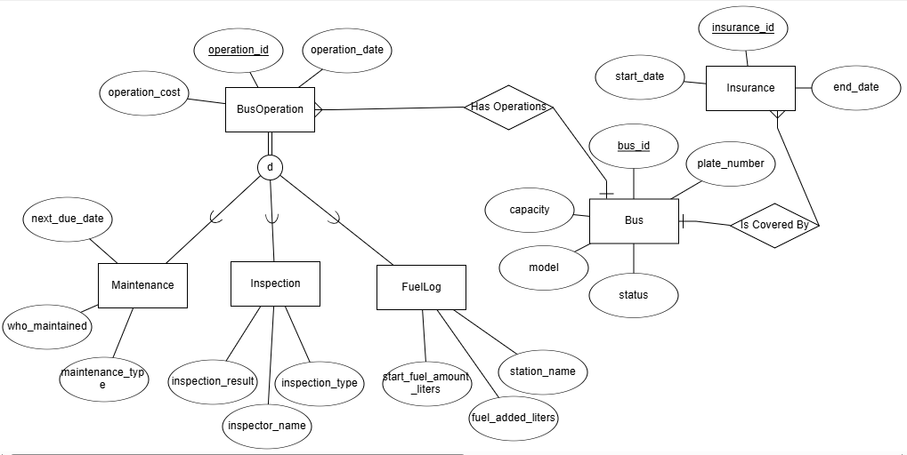

# Bus Company Management System

Naomi Reitzer and Sara Koskas

## Table of Contents  
- [Phase 1: Design and Build the Database](#phase-1-design-and-build-the-database)  
  - [Introduction](#introduction)  
  - [ERD (Entity-Relationship Diagram)](#erd-entity-relationship-diagram)  
  - [DSD (Data Structure Diagram)](#dsd-data-structure-diagram)  
  - [SQL Scripts](#sql-scripts)  
  - [Data](#data)
  - [Backup](#backup)

## Phase 1: Design and Build the Database  

### Introduction

The **Bus Company Management System** is designed to efficiently oversee the operations of a public transportation organization. This system ensures seamless coordination between different divisions, including fleet management, employee assignments, route scheduling, ticketing, finance, and customer support.

#### Purpose of the Database
This database serves as a structured and reliable solution for bus company operations by:
- **Managing the fleet through** detailed tracking of buses, maintenance records, fuel consumption and inspections.
- **Organizing driver and staff assignments,** ensuring proper scheduling and payroll management.
- **Optimizing route planning and scheduling** to improve operational efficiency and passenger service.  
- **Handling ticketing and booking,** allowing passengers to reserve seats and track ticket purchases.
- **Maintaining financial records,** including revenue, expenses, and tax reporting.
- **Providing customer support,** allowing for complaint tracking, lost-and-found management and feedback collection.

#### Potential Use Cases
- **Fleet Managers** can track bus maintenance, fuel logs and inspections to ensure operational efficiency. 
- **Drivers and Staff** can view their schedules, salary details and attendance records.
- **Passengers** can book tickets, view schedules, and submit feedback or complaints.
- **Customer Support Representatives** can manage inquiries, complaints and lost-and-found items.

This structured database enhances operational efficiency, financial tracking and customer satisfaction, making it an essential tool for managing large-scale bus transportation services.

###  ERD (Entity-Relationship Diagram)    
  

###  DSD (Data Structure Diagram)   
  

###  SQL Scripts  
Provide the following SQL scripts:  
- **Create Tables Script** - The SQL script for creating the database tables is available in the repository:  

📜 **[View `create_tables.sql`](Phase1/Scripts/FleetManagementCreateTable.sql)**  

- **Insert Data Script** - The SQL script for insert data to the database tables is available in the repository:  

📜 **[View `insert_tables.sql`](Phase1/Scripts/FleetManagementInsertTables.sql)**  
 
- **Drop Tables Script** - The SQL script for droping all tables is available in the repository:  

📜 **[View `drop_tables.sql`](Phase1/Scripts/FleetManagementDropTable.sql)**  

- **Select All Data Script**  - The SQL script for selectAll tables is available in the repository:  

📜 **[View `selectAll_tables.sql`](Phase1/Scripts/FleetManagementSelectAll.sql)**  
  
###  Data  
####  First tool: using [mockaro](https://www.mockaroo.com/) to create csv file
#####  Entering a data to Bus table
-  bus id scope 1-400
📜[View `Bus.csv`](Phase1/MockedData/Bus.csv)

results for  the command `SELECT COUNT(*) FROM Bus;`:

####  Second tool: using [generatedata](https://generatedata.com/generator). to create csv file 
#####  Entering a data to Insurance table
- insurance id scope 1-400
📜[View `Insurance.csv`](Phase1/MockedData/Insurance.csv)

results for  the command `SELECT COUNT(*) FROM Insurance;`:

####  Third tool: using python to create csv file
#####  Entering a data to BusOperation, FuelLog, Inspection and Maintenance tables
📜[View `generate_data.py`](Phase1/MockDataScript/generate_data.py)
[Enter CSV files folder](Phase1/MockedData)

### Backup 
-   backups files are kept with the date and hour of the backup:  
[Enter Backup folder](Phase1/Backup)
